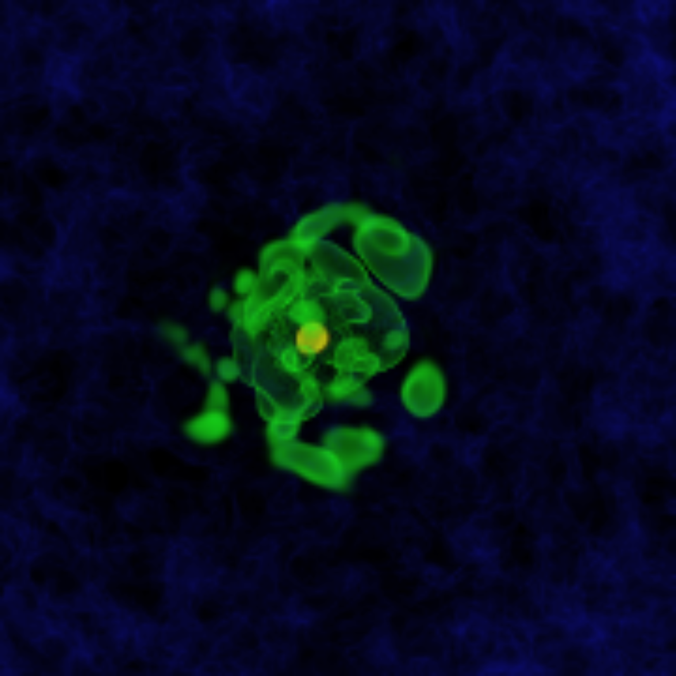
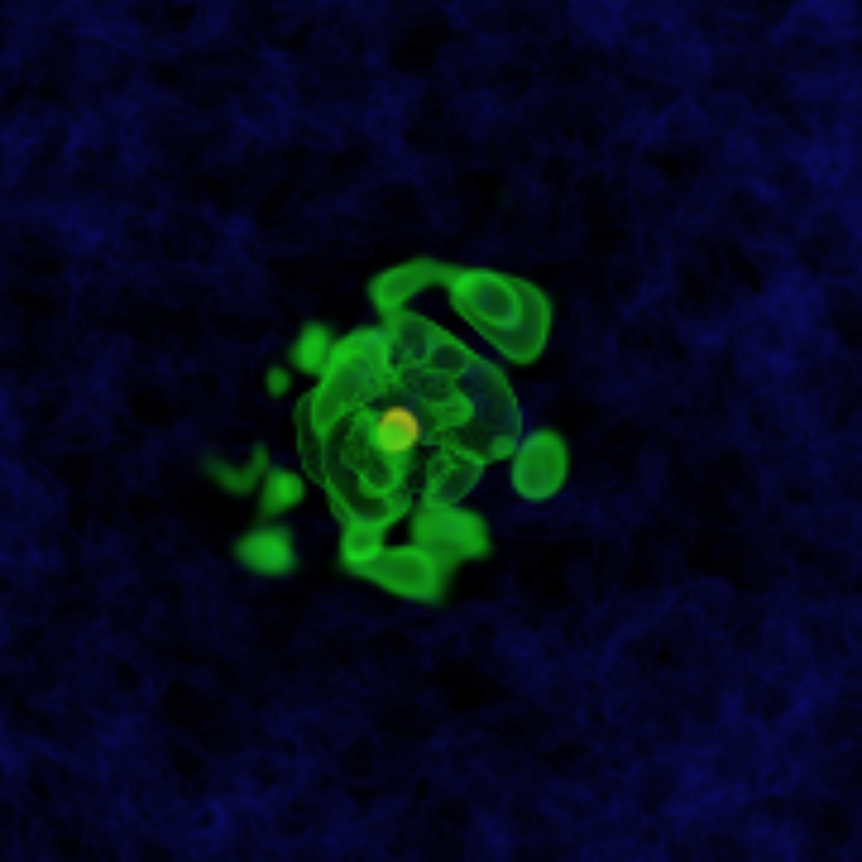
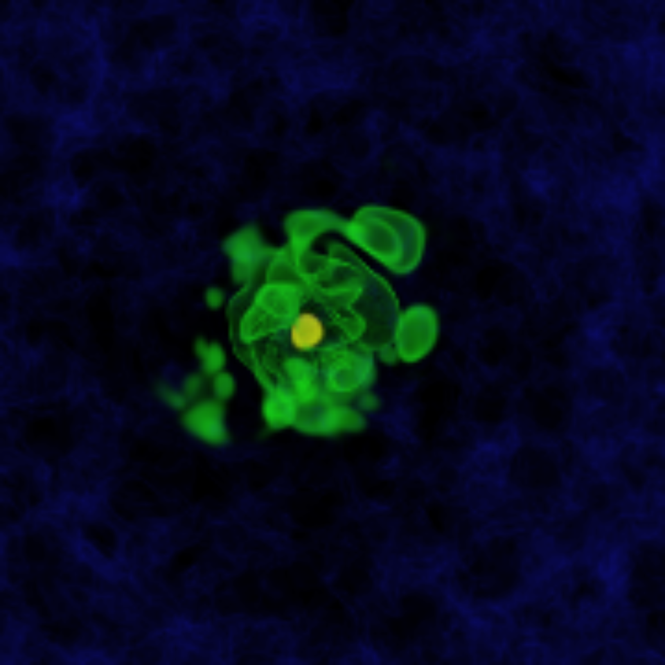
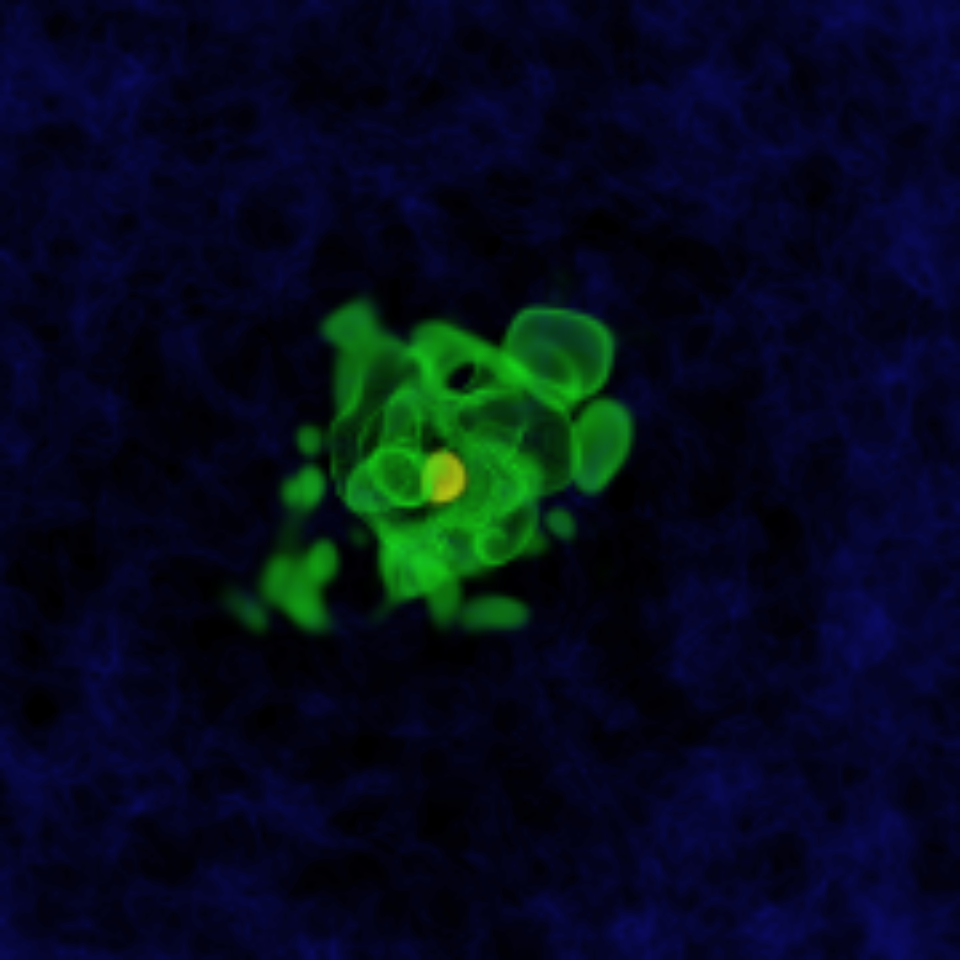

# Volume render of a 3D datacube

<p align="center">
  
  
  
  
</p>

## Introduction
Volume rendering is widely used in fields like entertainment, medicine, and scientific research. This computation-intensive process demands high performance solutions for efficient handling of large datasets.

This project aimed to convert a Python based volume rendering code into a serialized C++ implementation. We then developed parallel versions using OpenMP and MPI, followed by a performance analysis to evaluate the improvements.

The project was intended to run on Dardel supercomputer at the PDC Center for High Performance Computing. To run the OpenMP and MPI versions on personal computers, modifications to the Makefiles are necessary, including installing additional dependencies for OpenMP and MPI. These libraries were pre-installed on the Dardel system, so the provided instructions for OpenMP and MPI will work on Dardel but not on personal computers without these changes. The serial code however does not require modifications and can be run by following the instructions provided.

## Dependencies
This project was implemented with the following dependencies, which are the latest:
- Eigen: Version 3.4.0
- OpenCV: Version 4.9.0
- HDF5: Version 1.14.3
- GoogleTest: Version 1.14.0

To install the dependencies, run the following command in the project root directory:
```
chmod +x ./dependencies.sh
```

## Compiling and running the serial code
To compile the serial program and the tests:
'''
$ make 
'''

To run the serial program:
```
$ make run ARG
```
Where 'ARG' is the number of images you wish to process. The default is 10 images.

To run the tests:
```
$ make run tests
```

To clean up:
```
$ make clean
```

## Compiling and running on Dardel
For installing the dependencies:

### OpenCV
```
$ cd /Private/lib
$ git clone https://github.com/opencv/opencv.git
$ cd opencv
$ mkdir build && cd build
$ cmake .. -DCMAKE_INSTALL_PREFIX=~/Private/lib/opencv -DCMAKE_C_COMPILER=gcc -DCMAKE_CXX_COMPILER=g++
$ make -j1  # requires allocation
$ make install
```

### Eigen
```
$ cd /Private/lib
$ git clone https://github.com/HDFGroup/hdf5.git
$ cd Eigen
$ mkdir build && cd build
$ cmake .. -DCMAKE_INSTALL_PREFIX=~/Private/lib/eigen
$ make -j4 # requires allocation
$ make install 
```

### HDF5
```
$ /Private/lib
$ wget https://support.hdfgroup.org/ftp/HDF5/releases/hdf5-1.12/hdf5-1.12.0/src/hdf5-1.12.0.tar.gz
$ tar -xzf hdf5-1.12.0.tar.gz
$ cd hdf5-1.12.0
$ ./configure --prefix=/Private/lib/hdf5 --enable-cxx
$ make
$ make install
$ export LD_LIBRARY_PATH=~/Private/lib/hdf5/lib:~/Private/lib/opencv/lib64:$LD_LIBRARY_PATH
```
The paths in the Makefiles need to be adjusted based on the installations paths above.
The compilation for the following versions are done similary to that described above.

## OpenMP

Before execution, resource allocation via Slurm is required. Below is an example on how to request an allocation and run a program on an interactive node:
'''
$ salloc --nodes=1 -t 0:30:00 -A <allocation code> -p shared --ntasks-per-node=1 --cpus-per-task=4
$ OMP_NUM_THREADS=4
$ srun -n 1 ./volumerender ARG
'''

## MPI
Similarly, resource allocation is required before execution. Execute the code with varying processes as follows:
```
$ srun -n 4 ./volumerender ARG
```
Where 4 represents the number of processes.


## Serial
For running the serial code on Dardel, swap the Makefile in the Serial directory with the one existing in the MPI directory.


